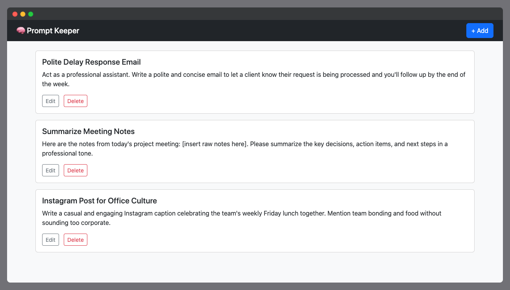

# Prompt Keeper 🧠

Prompt Keeper is a lightweight, privacy-friendly prompt storage app built using Alpine.js and localStorage. No accounts. No database. Just your thoughts, safely in your browser.



---

## 🚀 Features

* ✍️ Write and store prompts instantly
* 🏷️ Tag your prompts for easy filtering *(tagging/categorization planned)*
* 🧠 Auto-save to localStorage
* 📁 Export/import functionality *(planned)*
* 🌙 Dark mode support *(optional)*

---

## 🛠 Tech Stack

* Frontend: [Alpine.js](https://alpinejs.dev/) + TailwindCSS
* Backend (optional): Express.js static server for easy hosting
* Storage: localStorage

---

## 📦 Getting Started
1. Install dependencies

```bash
npm install
```

2. Start the server

```bash
node server.js
```

3. Visit the app

Then open
```bash
http://localhost:3000
```
in your browser.

---

## 💡 Notes for Beginners

This project is intentionally simple — designed to help junior devs explore Alpine.js, localStorage, and how to use Express to serve a frontend app. If you’ve never hosted your own front-end with Node.js before, this is a great place to start!

---

## 🌱 Development Phase

This is still an early build. Currently focusing on core prompt input and layout. Next steps include:

* Tag-based categorization system
* Prompt searching/filtering
* Backup/export functionality
* Drag-and-drop reordering

Feel free to fork or contribute!

---

## 🧸 Author Notes

> This app was born from my own habit of collecting prompts — ideas for writing, tools, or fun experiments. I often lost track of them, so I built this little keeper. It’s small, quiet, and here to help. Hope it helps you too.

---

## 📄 License

MIT
